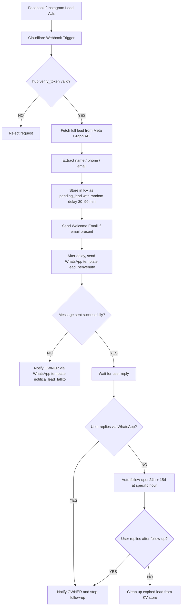

# **Lead-to-WhatsApp Automation**

[](https://workers.dev)
[](https://developers.facebook.com/docs/whatsapp/)
[](https://opensource.org/licenses/MIT)
[](https://gmvassago.it)

> **Zero-cost, zero-maintenance** pipeline that welcomes every new Facebook/Instagram Lead Ads contact with a personalized WhatsApp message and a welcome email—powered by Cloudflare Workers and Meta APIs.

---

## **✨ Features**

| Feature                       | Description                                                             |
| ----------------------------- | ----------------------------------------------------------------------- |
| **Free Hosting**              | Cloudflare Workers (100k req/day) with free TLS 1.3                     |
| **Instant Lead Capture**      | Webhook captures leads from any active or future Lead Ads form          |
| **WhatsApp Template Message** | Sends `lead_benvenuto` via WhatsApp Cloud API with dynamic parameters   |
| **Welcome Email**             | Instantly sends branded email via Resend when email is available        |
| **Follow-up Automation**      | Automatic follow-up after 24h and 15 days if no user reply is detected  |
| **Error Notification**        | Owner receives WhatsApp alert if message delivery fails                 |
| **Privacy-Friendly**          | All user data is stored temporarily and auto-purged for GDPR compliance |
| **Zero DevOps**               | Just `wrangler deploy` — no server to maintain, no certs, no cron setup |

---

## **📐 Logical Flow**



---

## **🛠️ Project Structure**

```
leadgen-worker/
├─ src/
│ └─ index.js # Cloudflare Worker (logic here)
├─ wrangler.toml # Worker configuration
└─ README.md # This file
```

---

## **🚀 Quick Start**

### 1. Clone & Install

```bash
git clone https://github.com/MissingPackage/leadgen-worker.git
cd leadgen-worker
npm install -g wrangler   # if not installed
```

### 2. Meta Setup

| Step               | Portal / Tool                                               | Action / Notes                                                                                                                              |
| ------------------ | ----------------------------------------------------------- | ------------------------------------------------------------------------------------------------------------------------------------------- |
| 1. App             | [developers.facebook.com](https://developers.facebook.com/) | Create Business app → add **WhatsApp** + **Webhooks** products                                                                              |
| 2. System-User     | Business Settings → System Users                            | Generate permanent token with:<br>`whatsapp_business_messaging`, `whatsapp_business_management`, `leads_retrieval`, `pages_read_engagement` |
| 3. Page Token      | Graph API Explorer                                          | `GET /me/accounts` → copy **Page access_token** (`pages_manage_metadata`, `leads_retrieval`)                                                |
| 4. Webhook         | App → Webhooks Product Page                                 | Callback URL: `https://<sub>.workers.dev/webhook`<br>Verify token: `leadgen2025` → subscribe `leadgen`                                      |
| 5. Install App     | Graph API Explorer                                          | `POST /<PAGE_ID>/subscribed_apps?subscribed_fields=leadgen` using **Page Token**                                                            |
| 6. WhatsApp Number | App → WhatsApp                                              | Add real number → copy **Phone Number ID**                                                                                                  |
| 7. Template        | Business Manager → WhatsApp Templates                       | Create & approve `lead_benvenuto`, `notifica_lead_fallito`, and follow-up templates                                                         |

### 3. Cloudflare Secrets

```bash
wrangler secret put VERIFY_TOKEN # es. leadgen2025
wrangler secret put FB_TOKEN # EAAB...
wrangler secret put WABA_TOKEN # EAAJ... (system-user)
wrangler secret put WHATSAPP_PHONE_ID # 115678901234567
wrangler secret put TEMPLATE_LEAD # lead_benvenuto
wrangler secret put TEMPLATE_NOTIFY # notifica_nuovo_messaggio
wrangler secret put TEMPLATE_FOLLOWUP1 # followup_24h
wrangler secret put TEMPLATE_FOLLOWUP2 # followup_15d
wrangler secret put TEMPLATE_FAIL # notifica_lead_fallito
wrangler secret put OWNER_PHONE # +3934xxxxxx
wrangler secret put RESEND_API_KEY
wrangler secret put RESEND_FROM_EMAIL
wrangler secret put RESEND_FROM_NAME
# Opzionali

wrangler secret put MEDIA_ID_LEAD # (image for welcome template) 4. Deploy

wrangler deploy
wrangler tail # watch logs. Create a test lead in the Lead Ads Testing Tool – your phone should receive the WhatsApp greeting in seconds.
```

---

## **🧩 Functional Overview**

### 1. Lead Capture & Email

- New lead triggers the Worker via webhook.

- Lead data is fetched from Meta Graph API.

- Email (if present) is used to send a personalized welcome email via Resend.

- Phone number is normalized and saved in KV with a 30–90 minute delay.

### 2. WhatsApp Template Delivery

- After delay, `lead_benvenuto` template is sent via WhatsApp Cloud API.

- If delivery fails (e.g. not a WhatsApp user), the OWNER receives a WhatsApp notification with error reason.

### 3. Reply & Relay Logic

- If the user replies:

- The OWNER is notified with name, number, and message content.

- All follow-ups are cancelled.

- The reply timestamp is saved to respect the 24h window constraint.

### 4. Follow-up Automation

- If no reply is received:

- 24h after first contact (at configured hour, default 19:00 UTC+3), followup_24h is sent.

- 15 days later, `followup_15d` is sent.

- After that, the lead is automatically deleted from the system.

### 5. Repeat Lead Submissions

- Even if a user previously interacted (has a lead: timestamp), a new lead triggers a new WhatsApp welcome message and email.

## Only the follow-up logic respects the lead:{phone} timestamp to decide whether to proceed.

## **✅ Use Case Summary**

| Scenario                        | Outcome                                                               |
| ------------------------------- | --------------------------------------------------------------------- |
| New lead (valid number/email)   | WhatsApp + Email sent (delayed), follow-ups scheduled                 |
| Number already responded before | Still gets welcome template & email; follow-ups blocked only if reply |
| Lead replies after template     | OWNER notified, follow-ups cancelled                                  |
| Lead never replies              | Gets follow-ups at 24h and 15d, then deleted                          |
| Invalid or non-WhatsApp number  | OWNER notified via `notifica_lead_fallito`                            |

## **⚙️ Configuration Notes**

- All timings, message templates, expiration TTLs, and follow-up logic are fully environment-configurable.

- Supports media header (image) in WhatsApp template messages.

- Extendable with custom channels (email, Telegram, CRM integrations).

## 🔄 **Token Rotation (optional)**

- System-User token is permanent.

- Page token lasts 60 days – add a Workers Cron:

```toml
[triggers]
crons = ["0 0 1 */2 *"] # every 60 days and call the token-extend endpoint, updating FB_TOKEN in KV or as a new secret.
```

## **📝 License**

**MIT © 2025 GMVassago Team / Cristiano Mazzella Solution Architect**

---

**_Last Updated June 2025._**
