# Lead-to-WhatsApp Automation

[](https://workers.dev)
[](https://developers.facebook.com/docs/whatsapp/)
[](https://opensource.org/licenses/MIT)
[](https://gmvassago.it)

> **Zero-cost, zero-maintenance** pipeline that greets every new Facebook/Instagram Lead-Ads contact with a personalised WhatsApp message—powered by Cloudflare Workers and Meta APIs.

---

## ✨ Features

|                            |                                                                            |
| -------------------------- | -------------------------------------------------------------------------- |
| **Always-Free Hosting**    | Cloudflare Workers free tier (100k req/day) with automatic TLS 1.3         |
| **Instant Lead Capture**   | Webhook on `leadgen` delivers the lead **from any present or future form** |
| **Personalised WhatsApp**  | Sends a template message (`lead_benvenuto`) using WhatsApp Cloud API       |
| **Follow-up Automations**  | Automatic, rule-based follow-up after 24h and 15 days, time-window aware   |
| **Resilient Notification** | If WhatsApp fails, instant notification to admin with reason & fallback    |
| **GDPR-ready**             | No permanent user data, all info is auto-expiring and periodically cleaned |
| **No Dev-Ops**             | `wrangler deploy` — that’s it. No servers, no cron cert renewals           |

---

## 📐 Logical Flow

```mermaid
flowchart TD
    A[Facebook / Instagram Lead Ads] --> B(Webhook su Cloudflare Worker)
    B --> C{hub.verify_token OK?}
    C -- NO --> Z1[Ignora richiesta]
    C -- Sì --> D[Fetch full lead da Meta API]
    D --> E[Estrai nome / telefono]
    E --> F[Salva lead in pending KV Store con delay 30-90 min]
    F --> G[waitUntil ritardo simulato]
    G --> H[Invia template WhatsApp lead_benvenuto]
    H --> I{Invio riuscito?}
    I -- NO --> J[Notifica OWNER via WhatsApp notifica_lead_fallito]
    I -- Sì --> K[Attendi risposta utente]
    K --> L{Risposta utente?}
    L -- Sì --> M[Notifica OWNER, cancella follow-up]
    L -- NO --> N[Follow-up automatici: 24h e 15gg]
    N --> O{Risposta dopo follow-up?}
    O -- Sì --> M
    O -- NO --> P[Cleanup lead da KV]
```



---

## 🛠️ Project Structure

```
leadgen-worker/
├─ src/
│ └─ index.js # Cloudflare Worker (logic here)
├─ wrangler.toml # Worker configuration
└─ README.md # This file
```

---

## 🚀 Quick Start

### 1. Clone & Install

```bash
git clone https://github.com/your-org/leadgen-worker.git
cd leadgen-worker
npm install -g wrangler   # if not installed
```

### 2. Meta Setup

| Step               | Portal / Tool                                               | Action / Notes                                                                                                                              |
| ------------------ | ----------------------------------------------------------- | ------------------------------------------------------------------------------------------------------------------------------------------- |
| 1. App             | [developers.facebook.com](https://developers.facebook.com/) | Create Business app → add **WhatsApp** + **Webhooks** products                                                                              |
| 2. System-User     | Business Settings → System Users                            | Generate permanent token with:<br>`whatsapp_business_messaging`, `whatsapp_business_management`, `leads_retrieval`, `pages_read_engagement` |
| 3. Page Token      | Graph API Explorer                                          | `GET /me/accounts` → copy **Page access_token** (`pages_manage_metadata`, `leads_retrieval`)                                                |
| 4. Webhook         | App → Webhooks Product Page                                 | Callback URL: `https://<sub>.workers.dev/webhook`<br>Verify token: `leadgen2025` → subscribe `leadgen`                                      |
| 5. Install App     | Graph API Explorer                                          | `POST /<PAGE_ID>/subscribed_apps?subscribed_fields=leadgen` using **Page Token**                                                            |
| 6. WhatsApp Number | App → WhatsApp                                              | Add real number → copy **Phone Number ID**                                                                                                  |
| 7. Template        | Business Manager → WhatsApp Templates                       | Create & approve `lead_benvenuto`, `notifica_lead_fallito`, and follow-up templates                                                         |

### 3. Cloudflare Secrets

```bash
wrangler secret put VERIFY_TOKEN # es. leadgen2025
wrangler secret put FB_TOKEN # EAAB...
wrangler secret put WABA_TOKEN # EAAJ... (system-user)
wrangler secret put WHATSAPP_PHONE_ID # 115678901234567
wrangler secret put TEMPLATE_LEAD # lead_benvenuto
wrangler secret put TEMPLATE_NOTIFY # notifica_nuovo_messaggio
wrangler secret put TEMPLATE_FOLLOWUP1 # followup_24h
wrangler secret put TEMPLATE_FOLLOWUP2 # followup_15d
wrangler secret put TEMPLATE_FAIL # notifica_lead_fallito
wrangler secret put OWNER_PHONE # +3934xxxxxx

# Opzionali

wrangler secret put MEDIA_ID_LEAD # (image for welcome template) 4. Deploy

wrangler deploy
wrangler tail # watch logs. Create a test lead in the Lead Ads Testing Tool – your phone should receive the WhatsApp greeting in seconds.
```

---

## 🧩 Functional & Error-Proof Flow (IT/EN)

### **Flusso funzionale**

1. **Arrivo Lead**

   - Il worker riceve una chiamata webhook da Meta con un nuovo lead (`leadgen_id`).

   - Estrae nome, telefono (normalizzato, aggiungendo +39 se serve), email.

   - Salva il lead in "pending" (su KV) con delay random (tra 30 e 90 min) per evitare lo spam e simulare un contatto umano.

   - Il log mostra sempre nome, telefono, email per controllo immediato.

   - Se il numero è mancante/non valido, il lead viene ignorato (con warning).

2. **Primo invio WhatsApp**

   - Dopo il delay, il worker invia il template lead_benvenuto via WhatsApp.

   - Se l’invio fallisce (es. numero non WhatsApp), Paolo (OWNER) riceve immediata notifica via template WhatsApp (`notifica_lead_fallito`) con nome, telefono, email e motivazione tecnica.

   - Il log indica successo o errore.

3. **Gestione Risposta**

   - Se il lead risponde via WhatsApp in qualunque momento:

   - Paolo riceve notifica immediata con nome, numero, email, testo breve.

   - I follow-up futuri vengono cancellati e non sarà più automatizzato nessun messaggio.

   - Tutto è tracciato via timestamp in KV, così si mantiene la compliance sulla finestra di 24h di WhatsApp.

4. **Follow-up automatici**

   - Se il lead non risponde mai:

   - Primo follow-up alle 19:00 (UTC+3, configurabile via ENV) il giorno dopo il primo contatto.

   - Secondo follow-up 15 giorni dopo, sempre alle 19:00.

   - Se dopo i due follow-up non c’è risposta, il lead viene pulito dal sistema.

   - Nessun follow-up se la persona ha risposto almeno una volta.

5. **Risposta da Paolo (OWNER)**

   - Paolo può rispondere solo "in reply" al messaggio notificato.

   - Il messaggio viene inoltrato all’utente come testo, se la finestra WhatsApp è aperta.

   - Se la finestra 24h è chiusa, viene inviato prima un template di re-engagement, poi il testo.

6. **Pulizia e monitoraggio**

   - Tutti i dati (lead, messaggi, follow-up) sono auto-expiring dopo un periodo configurabile (default 20gg).

   - Il KV viene periodicamente ripulito per garantire compliance e zero accumulo inutile.

   - I log di Cloudflare Worker offrono sempre nome, telefono, email e status di ogni azione.

---

## **Summary — All possible scenarios**

- ✅ **Numero WhatsApp valido**: riceve template, eventuali follow-up, se risponde blocca le automazioni.

- ❌ **Numero errato/non WhatsApp**: Paolo riceve notifica con error reason.

- ⏳ **Lead che non risponde mai**: riceve follow-up a 24h (19:00 UTC+3) e 15gg; poi cleanup.

- 💬 **Lead che risponde**: Paolo riceve notifica, follow-up cancellati.

- 🧹 **Nessun dato personale permanente**: tutti i dati (nome, telefono, email, interazioni) vengono cancellati dopo massimo 20 giorni.

---

## **Configurazione avanzata / Ambiente**

- Delay, orario follow-up, giorni cleanup, template names… tutti parametri sono configurabili via variabili d’ambiente (`wrangler secret put`).

- Supporto template WhatsApp con media header (immagine di benvenuto).

- Puoi aggiungere rapidamente altri canali di notifica (es. email, Telegram) modificando il worker.

## 🔄 **Token Refresh (optional)**

- System-User token is permanent.

- Page token lasts 60 days – add a Workers Cron:

```toml
[triggers]
crons = ["0 0 1 */2 *"] # every 60 days and call the token-extend endpoint, updating FB_TOKEN in KV or as a new secret.
```

## 📝 License

**MIT © 2025 GMVassago Team / Cristiano Mazzella Solution Architect**

---

Documentazione aggiornata a giugno 2025.
